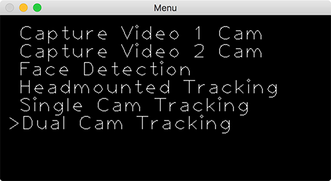
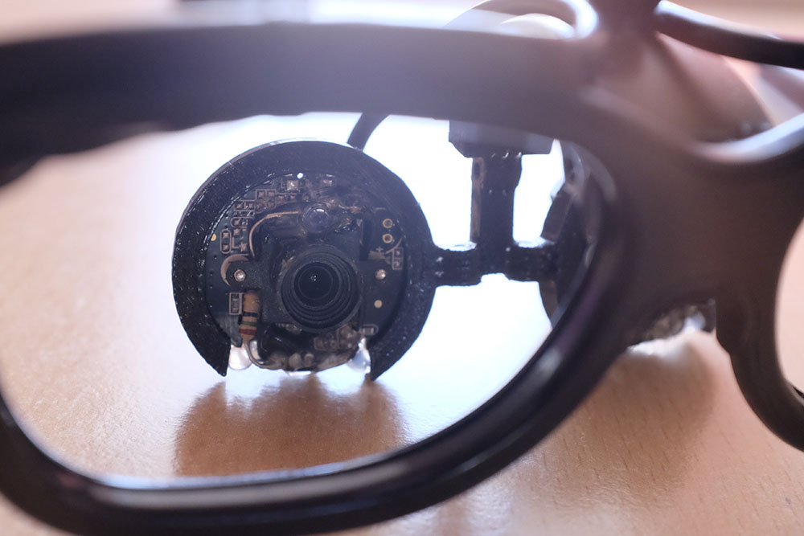
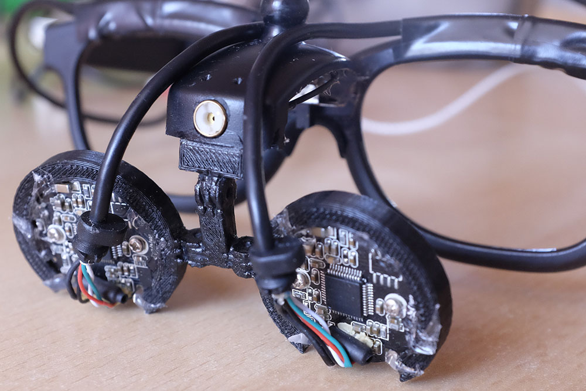
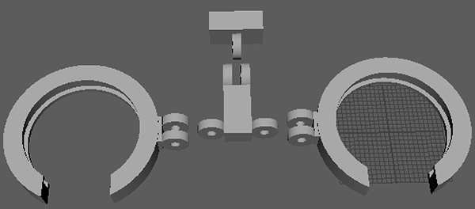

# EyeFocus

Realtime image based eye focus distance estimation for consumer grade head-mounted webcams. 
The estimation is done with a polynomial function based on plain eye vergence. With Dual Cam Tracking mode and an uncertainty of **3.5 cm** estimation is possible up to **70 cm**.  
For Eye Tracking three implementations are currently available: [Means of Gradients][1] by Timm and Barth and [ExCuSe][2] & [ElSe][3] by Fuhl et al..

This project was developed during my bachelor thesis.
Tested with macOS and Windows.

## Modes

__Capture Video 1 Cam & 2 Cam__

Single Cam and Dual Cam live stream frame extractor. Ask user to focus on specific distance point and record video frames to separate folder `Recording/0/80`. Where `0` is the camera index and `80` is the focus depth.

Process will start with 85 cm which is an inactive state. Press spacebar to move 5 cm closer. Every 10 cm step is recorded. Either with one or with two cameras.

__Face Detection__

Same logic as in Headmounted Tracking but as the name suggests; tries to find the face first. For this mode no headmounted setup is needed. However don't expect to get any good distance estimation results from that.

__Headmounted Tracking__

One camera setup where both pupils are visible. In an initial setup phase the eye region and inner eye corner region are selected (two points per eye and one for each corner). Click at the eye center and the other click is for the radius. Both eyes first, then eye corners.

__Single Cam Tracking__

Use pupils x-coordinate for distance estimation. Calibration process involves looking at 20 cm, 50 cm and 80 cm distance. Press spacebar to confirm eye position.

__Dual Cam Tracking__

The actual heart of this project. Distance estimation based on both pupils position. The calibration process is fast and easy. Focus on at least 3 distance points and press spacebar how often you like. Each time a measurement is taken for this specific distance. Press key `0 - 9` to set the equivalent distance in 10 cm (e.g., `7` = 70 cm). Confirm the measurement points with return key. `r` to reset calibration.

## Usage:
> ./eyeFocus {-[0-5]} {-half} {path} {file}

- Select mode directly with `-[0-5]`; where the number represents the menu index (starting with 0).
- Scale down the video input by a factor of two with `-h` or `-half`
- Use `path` to load a video file directly. This can also be a camera index. For Dual Cam Tracking this must be the folder containing the `0` and `1` directory.
- `file` is used only for Dual Cam Tracking and must be a file present in both folders mentioned above.

DualCam example: `./eyeFocus -5 -h '../videos/series5/' 10cm.MP4`

## Dual Cam Setup

For the Dual Cam Tracking mode two webcams are mounted on a glasses frame. The frame is taken from 3D cinema glasses and the mounted webcams are two *Speedlink SL-6825-BK Snappy Smart Webcam*. They are cheap and focus is manually adjustable. On both is an IR LED soldered directly to the circuit board as you can see in the image below (above the lens).

The cameras are hold together with a 3D printed holder ([STL file][4] in `doc` folder). It is connected with the frame by a piece of plastic (the baseplate of one of the webcams). Everything is held together with instant glue.

 [1]: http://www.inb.uni-luebeck.de/fileadmin/files/PUBPDFS/TiBa11b.pdf
 [2]: http://www.ti.uni-tuebingen.de/uploads/tx_timitarbeiter/ExCuSe_01.pdf
 [3]: https://www.ti.uni-tuebingen.de/uploads/tx_timitarbeiter/ElSe.pdf
 [4]: ./doc/cam_holder.stl